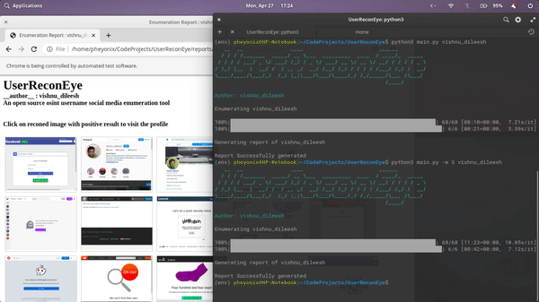
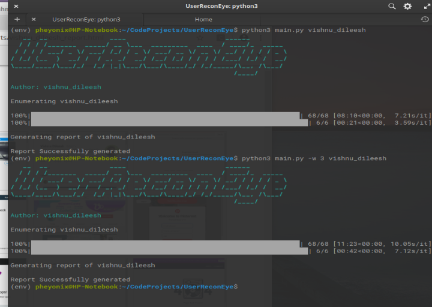
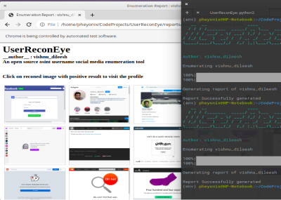

## UserReconEye

Automated Username OSINT tool which scans over 70 social media sites for profiles with the given username and generates a report with screenshots of social media profile urls

---

## UserReconEye Demo

 

 

---
## Usage

> Clone the Git Repository

`$ git clone https://github.com/VishnuDileesh/UserReconEye.git`

> Change to the cloned Repository folder

`$ cd UserReconEye`

> Install the necessary packages

`$ pip3 install -r requirements.txt`

> Run the tool on default mode

`$ python3 main.py vishnu_dileesh`

> Run the tool with delay mode for slower internet connection

`$ python3 main.py -w 3 vishnu_dileesh`

> For help

`$ python3 main.py --help`

---

## Legal Disclaimer

The tool/script UserReconEye was built with good intentions for use in legal OSINT Research purposes. It's the end user's responsibility to obey all applicable local, state and federal laws. I assume no liability and are not responsible for any misuse or damage caused by this program. Only use for educational purposes.
